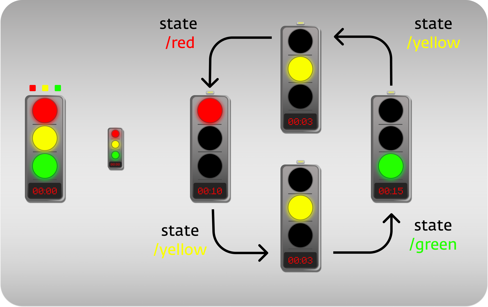

# Traffic Light

## Project setup
```
npm install
```

### Compiles and hot-reloads for development
```
npm run start
```

### Compiles and minifies for production
```
npm run build
```

### Lints and fixes files
```
npm run lint
```
### Scheme processing


### Figma Link
<https://www.figma.com/file/1LaLdYtG5UTRsS0TYrMR3x/traffic-light?node-id=0%3A1>